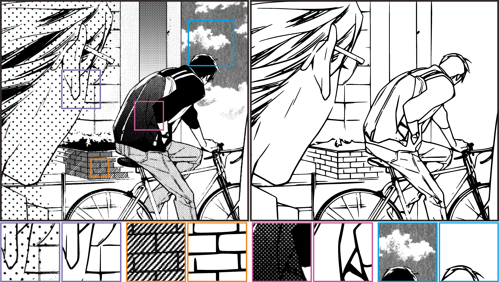

## 明爱专上学院 刘雪婷项目组和李承泽项目组招聘研究助理 (2023-24新一批)

### 有关项目组

刘雪婷博士分别于2009年和2014年在清华大学获得工学学士和文学学士学位，并在香港中文大学获得博士学位。之后于2014年至2018年在香港中文大学计算机科学与工程系担任博士后研究员。目前是明爱高等教育学院计算机与信息科学学院的助理教授。

李承泽博士于2013在中国科学技术大学获得工学学士学位，并于2020年在香港中文大学获得博士学位。目前是明爱高等教育学院计算机与信息科学学院的助理教授。

两个项目组的研究主要围绕包括计算机图形学、计算机视觉、计算和智能艺术，以及深度学习等。两位老师曾经有多篇一作论文发表于顶级计算机图形学期刊。在此列举数个研究如下：

本项目研究并试图进行漫画的自动风格转换。我们发现，风格转换中的主要障碍来自于黑白网点纹理和彩色填充技巧之间的差异。为了解决这一障碍，我们提出了一种变分自编码器，将漫画图片编码为一个中间表征用以总结局部纹理特征。我们提出的这个基于学习的模型有效地统一了网点填充和颜色填充的特性，为黑白网点漫画和彩色漫画之间的双向转换提供了便利。我们进一步提出了一种基于学习的在中间表征和彩色漫画之间进行转换的网络模型。我们的模型可以在给定彩色漫画的情况下生成优秀的黑白网点漫画。我们的模型也可以尽可能保留漫画原本语义的情况下生成高质量的彩色漫画。

该项目从漫画图像中尝试自动提取结构线条。结构线的提取对于将传统漫画迁移到数字领域至关重要。然而，将结构线从任意的、高度结构化的、黑白的网点贴图中区分出来是一件非常具有挑战性的任务。我们提出了一种全新的基于数据驱动的方法，在完全不假设网点贴图类型的情况下，从模式丰富的漫画中识别结构线。该方法基于一个定制的卷积神经网络模型。我们还开发了一种高效的方法来生成丰富的训练数据集。我们在大量不同画风的漫画上对我们的方法进行了评估，结果表明我们的方法可以从任意的网点漫画中提取结构信息。

手绘动画因为缺乏物理水平，因此很难基于手绘动画进行立体效果的渲染。我们提出了一种方法，从普通的二维输入中合成真实的胶片动画(cel animation)，并且不需要大量的人工标注或三维几何重建。我们的主要贡献是通过将问题表述为一个图切问题来解决排序的时间不一致性。然而，由此产生的排序仍然不足以产生令人信服的立体效果，因为排序由于其不连续的性质，不能直接用于深度分配。我们进一步通过优化过程来合成深度，并将排序制定为约束条件。我们的方法已经在大量的胶片动画上进行了评估，在所有情况下都获得了令人信服的立体效果。

想了解详细信息，欢迎查看我们的Google Scholar链接：

[Chengze Li](https://scholar.google.com/citations?user=YGm_OT4AAAAJ)
[Xueting Liu](https://scholar.google.com/citations?user=2WsPjv4AAAAJ)

### 招聘要求

本项目组的工作主要围绕数字媒体（特别是**二次元**）方向的研究，欢迎所有对计算机视觉或图形学感兴趣，并希望进行一定科研或创作的同学加入我们的项目。

我们希望你：

+  有扎实的数理基础
+  掌握计算机视觉或图形学的基本知识
+  对近期的机器学习和深度学习算法了解较为全面，并有一定的实验能力
+  了解Python编程，以及numpy/scipy/sklearn等基础库
+  具有责任心，有良好的沟通能力

加分项

+ 熟练掌握OpenCV，可以自行实现一定的图像处理流程
+ 了解近期的跨模态和生成式模型，例如ViT、CLIP及Diffusion Model等
+ 参与过研究项目，能在一定程度上自行设计实验
+ 有较好GPA，或任何的竞赛或论文成绩

本职位需要申请[香港工作签证](https://www.immd.gov.hk/hkt/services/visas/ASMTP.html)并在香港**全职工作**，每周约40小时工作时间。工资范围在HKD18,000至22,000左右。

### 为什么选择本职位

本职位非常适合希望在香港继续进行MPhil或PhD学习，但目前仍未决定去向的本科毕业生。本项目组两位老师均毕业于香港中文大学，并且有能力参与发表行业第一梯队的论文，例如ACM SIGGRAPH、Eurographics、CVPR、ICCV等。本职位提供在香港本地进行研究的机会，并且有良好的工作环境。相信本职位进行的科研辅导能够帮助你更好的提升自己的研究能力，并提升自己的工作经验，以促进未来更好的学业或工作发展。

本职位同样也其他感兴趣的本科、研究生同学以及实习生参与，但招聘要求基本不变。另外实习需要校方同意方可进行。如果有兴趣，同样欢迎来信询问，薪资工作时间等另议。

### 联系方式

请联系本仓库（repository）的作者，邮件地址可以在作者的GitHub个人页面找到。也可以通过我们的[学校主页](https://cihe.edu.hk/en/schools-and-offices/schools-and-departments/school-of-computing-and-information-sciences/staff-directory/index.html)联系我们。

发送邮件请附上个人简历以及成绩单。本职位数量有限，请尽快投递。

### 有关本学院

明爱专上学院(CIHE)及明爱白英奇专业学校(CBCC)分别于1985和1971年成立，历史悠久，致力提供专上教育。 CIHE由2001年起成为以专上学院条例注册的认可院校，并于2011年正式获得颁授学位资格，与姊妹学校CBCC（主要开办副学位）紧密合作，以成为圣方济各大学为发展目标。两校的双院校制提供灵活、多元的升学途径，所开办的研究生、学士学位、副学位及文凭课程涵盖超过35个专业范畴，致力为来自不同社会阶层的学生提供高质素的职业专才教育。

